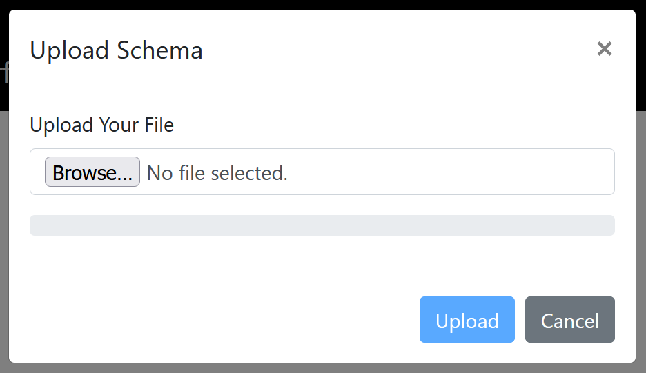
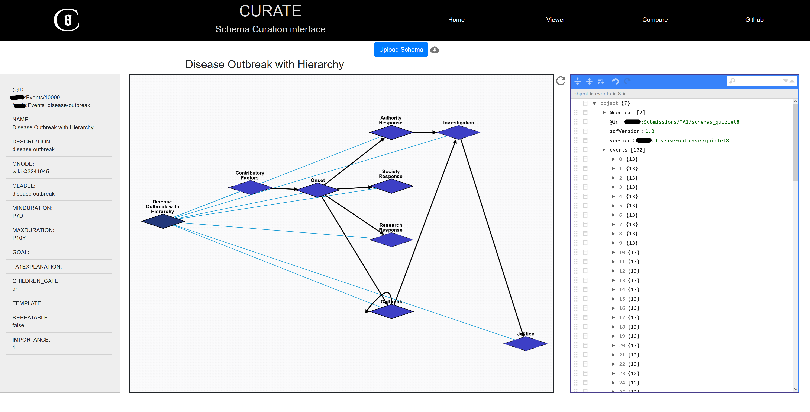
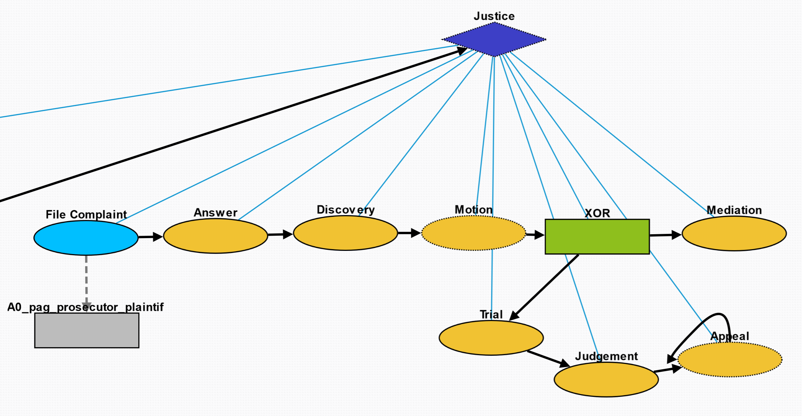

# Usage
Overview of the viewer and how to use it
---
- [Usage](#usage)
  - [Overview of the viewer and how to use it](#overview-of-the-viewer-and-how-to-use-it)
  - [Upload](#upload)
  - [Viewer](#viewer)
  - [Legend](#legend)
    - [Nodes](#nodes)
    - [Edges](#edges)
  - [JSON Editor](#json-editor)

---
## Upload

Browse for the JSON and upload it. If upload is successful, the pop-up will close and you will see a graph and the JSON editor. Right-click any node to open the sidebar to the left.

## Viewer

Right-click the background to close the sidebar.

Left click any node to show the subtree of child nodes and any participants, if applicable. Drag the nodes around for ease of visualization.

## Legend

### Nodes
- blue diamond: parent node; this node has sub-events
- yellow circle: child node; this node may have participants
- **gray** rectangle: participant node
- **green** rectangle: XOR gate. The nodes this gate points to occur mutually exclusively
- dashed edge: optional event
### Edges 
- blue thin lines: parent-child edges that show hierarchy
- thick black arrows: temporal edges that show the sequence of events. Repeatable events point to themselves
- gray dashed arrows: participant edges showing what event the participant belongs to

## JSON Editor
Any modifications in this editor will be reflected in the graph. From left to right, the top bar consists of:
- Expand all fields
- Collapse all fields
- Sort contents
- Undo
- Redo
- Search bar
The six dots next to each entry allows you to drag the entry and move it up and down the JSON. This applies for blocks of JSON, such as an entire event.

The box allows for insertion, duplication, and removal. **⚠ A bug has been discovered where an empty string will crash the website, so please use duplication when adding new information.**